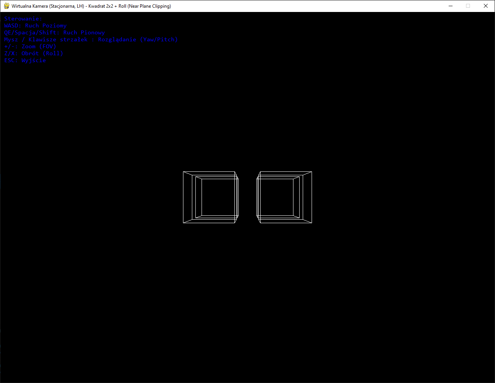
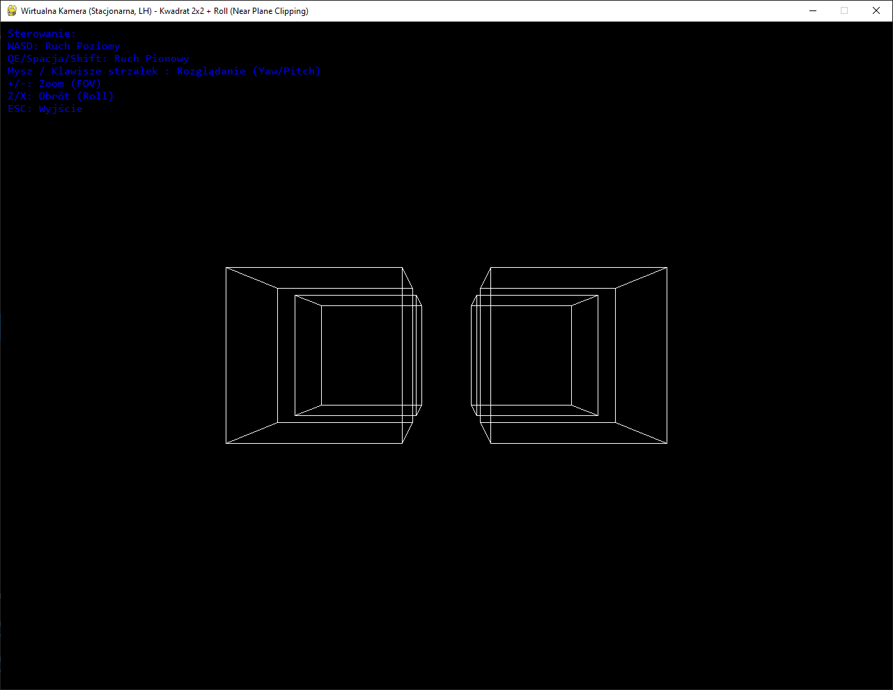
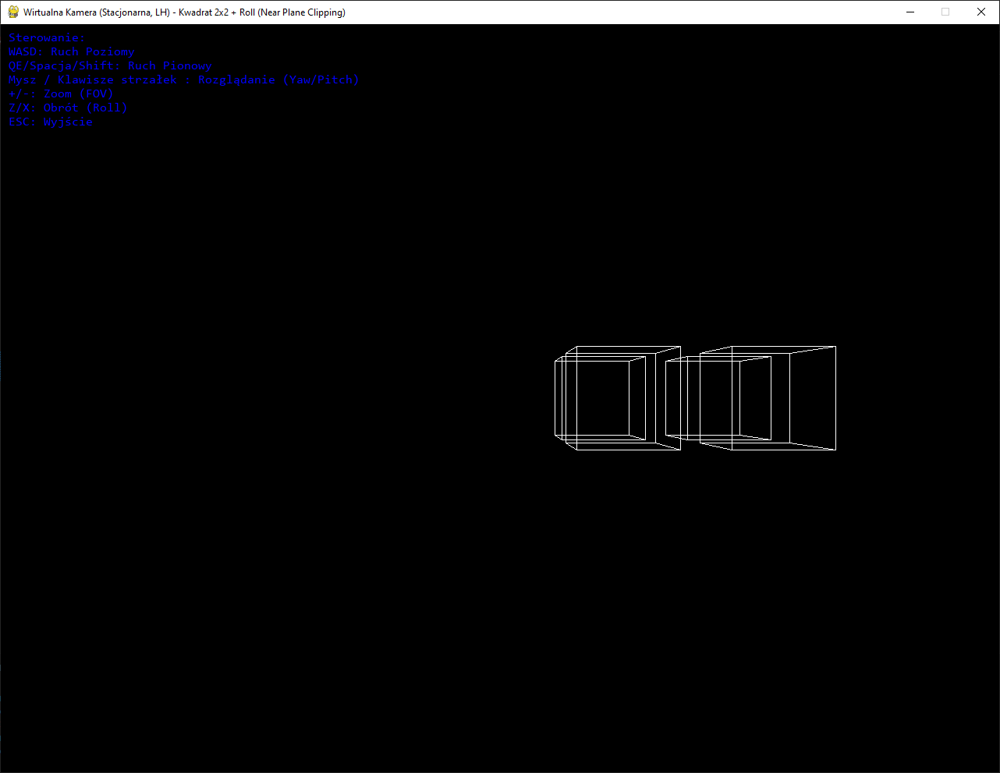
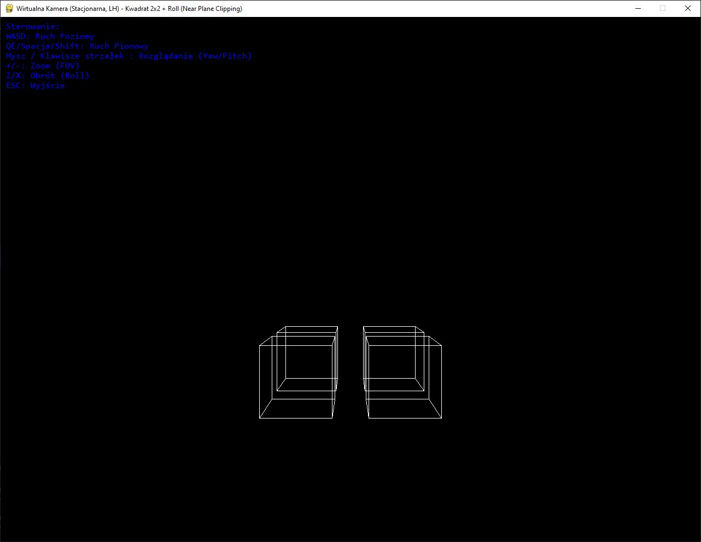
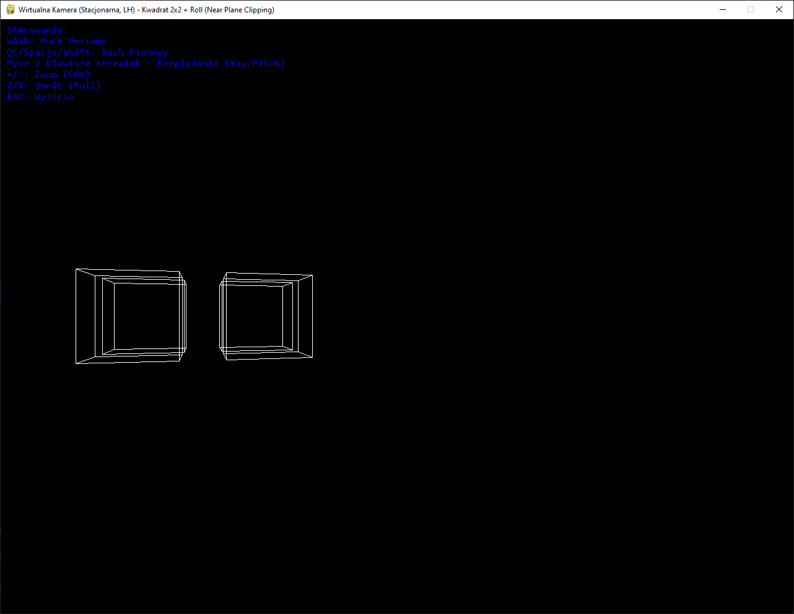
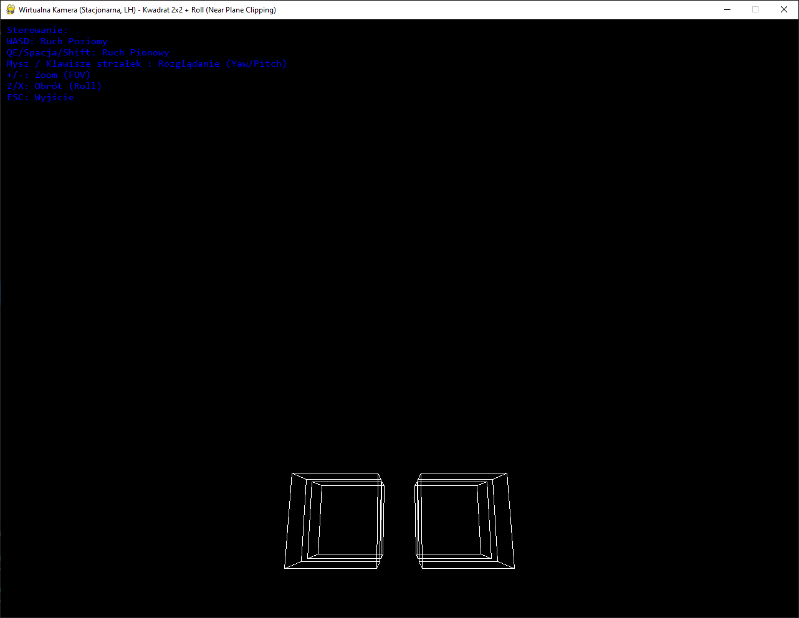
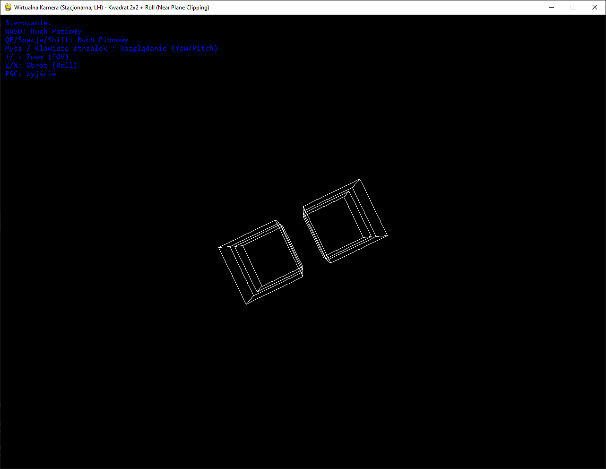
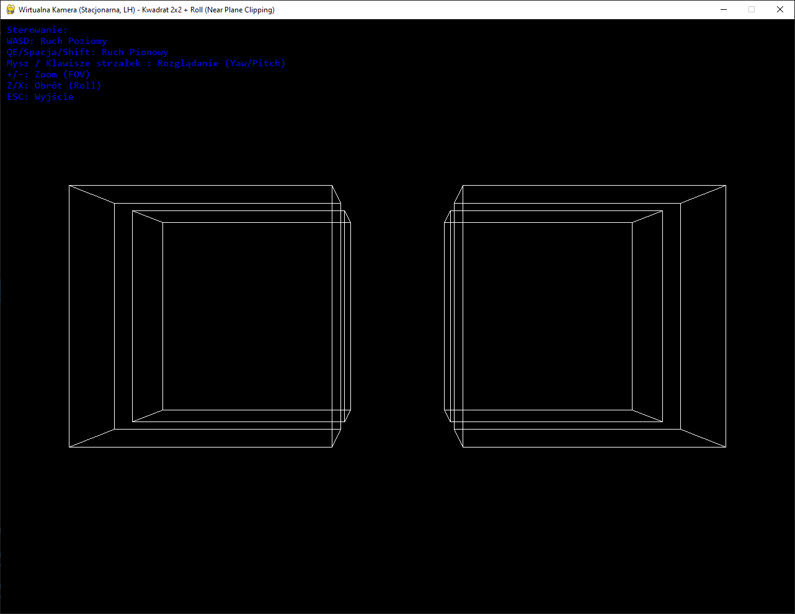
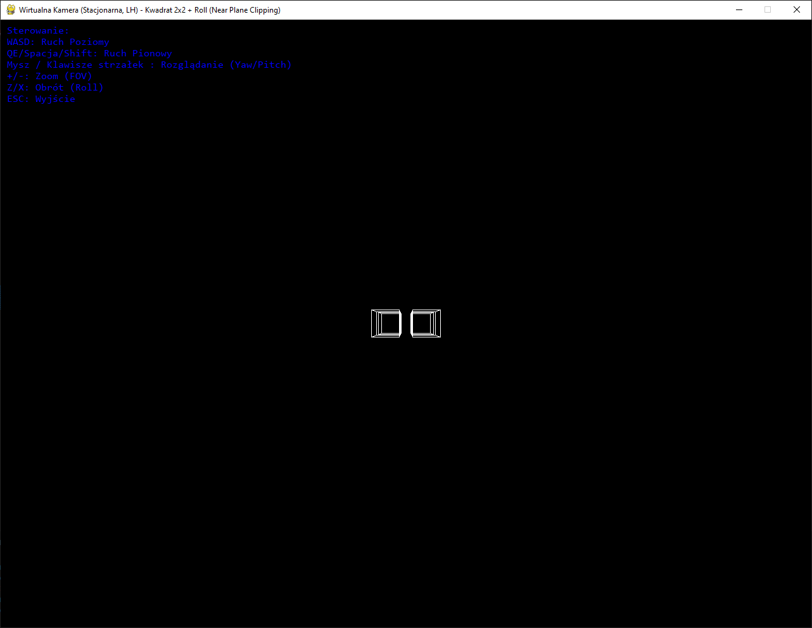
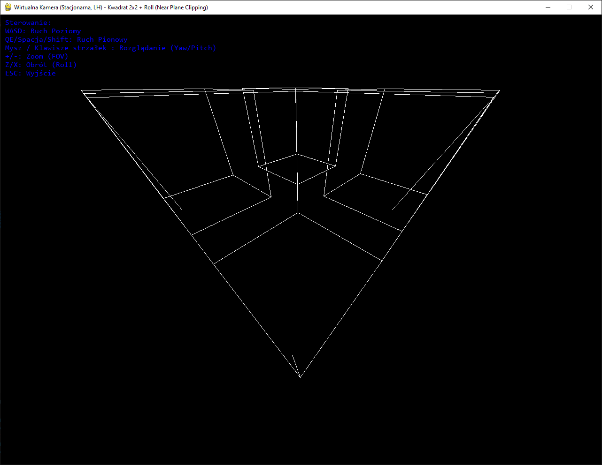

# Sprawozdanie z Projektu: Wirtualna Kamera 3D

**Autor:** Jakub Klenkiewicz (325484)

## 1. Cel Wizualny Projektu

Celem projektu było stworzenie interaktywnej wizualizacji trójwymiarowej sceny. Aplikacja renderuje prostą przestrzeń zawierającą cztery sześciany i pozwala użytkownikowi na swobodną eksplorację tej sceny za pomocą wirtualnej kamery, umożliwiając obserwację z różnych perspektyw, zmianę kierunku patrzenia oraz przybliżanie i oddalanie widoku (zoom).

## 2. Wizualizowana Scena

Scena składa się z czterech sześcianów, każdy przedstawiony jako model krawędziowy (widoczne tylko krawędzie). Sześciany są rozmieszczone w układzie 2x2 na płaszczyźnie w przestrzeni wirtualnej.

_Opis: Ogólny widok sceny z domyślnej pozycji kamery._

## 3. Zastosowane Techniki Wizualizacji

Do stworzenia interaktywnego widoku 3D wykorzystano standardowe techniki grafiki komputerowej:

- **Pozycjonowanie Obiektów:** Każdy sześcian jest umieszczany w scenie za pomocą transformacji translacji (przesunięcia), tworząc układ 2x2.
- **Definicja Punktu Widzenia:** Wirtualna kamera definiuje punkt, z którego obserwujemy scenę. Jej pozycja i orientacja (obrót w trzech osiach: Yaw - wokół osi pionowej, Pitch - wokół osi poprzecznej, Roll - wokół osi podłużnej) determinują, co jest widoczne na ekranie. Ruch kamery jest symulowany poprzez odpowiednie transformacje sceny.
- **Projekcja Perspektywiczna:** Scena 3D jest rzutowana na płaski, dwuwymiarowy ekran z zachowaniem perspektywy. Oznacza to, że obiekty znajdujące się dalej wydają się mniejsze, a linie równoległe zbiegają się w oddali, co tworzy iluzję głębi. Zmiana Kąta Widzenia (Field of View - FOV) pozwala na uzyskanie efektu zoomu.
- **Potok Transformacji:** Współrzędne wierzchołków każdego sześcianu są kolejno transformowane (Model -> Widok -> Projekcja), aby finalnie określić ich pozycję na ekranie 2D.

## 4. Weryfikacja Działania Operacji Kamery

Poniżej przedstawiono wizualną weryfikację działania kluczowych operacji kamery zgodnie ze specyfikacją. Każda operacja jest zilustrowana zrzutem ekranu pokazującym efekt jej zastosowania w porównaniu do widoku początkowego (lub poprzedniego stanu).

**Widok początkowy do porównań:**

_Opis: Ten sam widok co Screenshot 1, jako punkt odniesienia._

**4.1. Translacja (Symulacja Ruchu Kamery)**

- **Ruch do przodu (klawisz W):** Obiekty w scenie stają się wizualnie większe.
  
  _Opis: Widok po wykonaniu ruchu do przodu._
- **Ruch w lewo (klawisz A):** Scena przesuwa się wizualnie w prawo.
  
  _Opis: Widok po wykonaniu ruchu w lewo._
- **Ruch w górę (klawisz E / Spacja):** Scena przesuwa się wizualnie w dół.
  
  _Opis: Widok po wykonaniu ruchu w górę._

**4.2. Rotacja (Zmiana Orientacji Kamery)**

- **Obrót w prawo (Yaw):** Widok obraca się wokół osi pionowej.
  
  _Opis: Widok po obróceniu kamery w prawo (Yaw)._
- **Pochylenie w górę (Pitch):** Widok obraca się wokół osi poprzecznej.
  
  _Opis: Widok po pochyleniu kamery w górę (Pitch)._
- **Przechylenie w prawo (Roll - klawisz X):** Widok obraca się wokół osi podłużnej.
  
  _Opis: Widok po przechyleniu kamery w prawo (Roll)._

**4.3. Zmiana Pola Widzenia (Zoom)**

- **Przybliżenie (Zoom In):** Zmniejszenie FOV, powiększenie centrum obrazu.
  
  _Opis: Widok po przybliżeniu (zmniejszenie FOV)._
- **Oddalenie (Zoom Out):** Zwiększenie FOV, poszerzenie widoku.
  
  _Opis: Widok po oddaleniu (zwiększenie FOV)._

**4.4. Przycinanie Bliską Płaszczyzną (Near Plane Clipping)**

Krawędzie przecinające bliską płaszczyznę są skracane.

- Oczekiwany efekt: Gdy obiekt zbliża się bardzo blisko, jego fragmenty znikają. (Powiększony FOV dla lepszej widoczności bliskiej płaszczyzny)
  
  _Opis: Widok z bliska pokazujący sześcian przycinany przez bliską płaszczyznę._

## 5. Podsumowanie Wizualne

Projekt z powodzeniem demonstruje implementację podstawowych operacji wirtualnej kamery 3D. Weryfikacja wizualna potwierdza poprawne działanie translacji, rotacji, zoomu oraz mechanizmu przycinania, zapewniając spójne i oczekiwane wrażenia wizualne.
